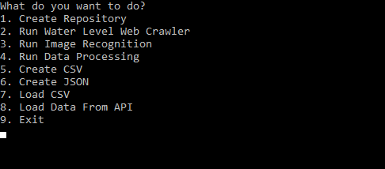

# ChartPlotterDataProcessorML

## Running Data Processing 

##### Without real data
1. Compile solution.
2. (OPTIONAL) Move appconfig.cfg next to ChartPlotterDataProcessorML.exe, skip to load default settings.
3. Run with debugging to start InMemoryDataService, or run it manually.
4. "8" to load fake data from InMemoryDataService.
5. "4" to process data.
6. Before saving processed data to JSON/CSV choose "1" to create folders.

##### With real data
1. Compile solution
2. Move appconfig.cfg next to ChartPlotterDataProcessorML.exe, add [MeasurementPoints] if needed.
3. Run, choose "1" to create folders and "2" to load water level measurements.
4. Open location config (default: "data/locationconfigs/") and set desired value to DefaultWaterLevel.
5. Create new section [ShoreLine1], add gps-points to mark "edges" of shoreline. Data processing will create lines between the points.
6. Repeat for [ShoreLine2].
4. Create folder to "InputCsvDir"(default: "data/csv") for each location and place all CSV-files there.
5. Run, "7" to load CSVs. 
6. "4" to process data.

CSV-files must follow format:
```sh
UnixTime,WaterDepth,Heatmap,GpsLat,GpsLng,GpsAlt,GpsSpeed,GpsHeading,GpsLatError,GpsLngError,GpsAltError,AirTemp,WaterTemp
```
```csv
1527280417,0.0,0,65.788605,24.519111667,-8.1,0.535,145.81,11.503,9.762,18.17,20.0,10.0
```
ShoreLine section example:
```csharp
[Shoreline1]
Point={50.111111, 20,111111}
Point={50.111222, 20,111222} 
```

## Running Image Recognition 

1. Complete steps for "Running Data Processing with real data".
2. Create folders under "FirstDigitLearningImagesDir" (default: "data/learningimages/firstdigit") place learning images with first digit: 0 to folder "0", with 1 to folder "1" etc.
3. Repeat for "SecondDigitLearningImagesDir". (default: "data/learningimages/seconddigit")
4. Place all target images (images to recognize) to "ImageDir". (default: "data/images")
5. Make sure target images have unix time as filename.
6. Run and "3".
